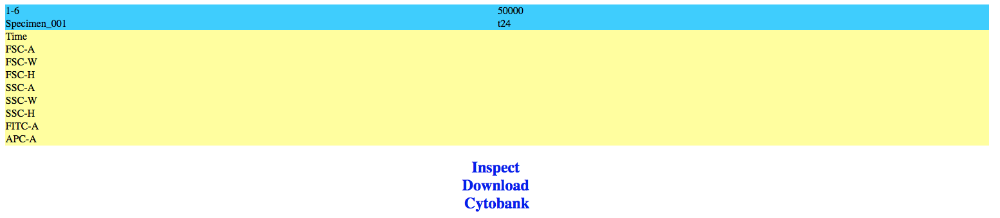
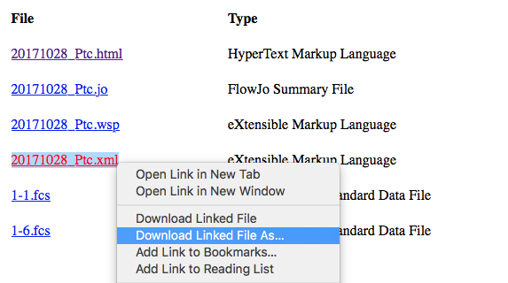

# FACS-import
Import BDFacsDIVA project into FlowJo

## Instructions
The application is located in [MacOSRelease](MacOS Release)

Please download and unzip the files.

"Antique" is for old MacOS versions, e.g. Mavericks.

"FACSconverter" is for newer versions, e.g. versions after Yosemite.

Depending on your settings, Mac FileVault can block the application from running. In that case,
right click on the Application Icon and select "Open".

To use this application, you need to prepare two files, namely, the wsp file and xml file from the CytoBank.

CytoBank can be accessed at http://facsdata.stanford.edu:8080/ERS/user/HomePage.jsp
You will need to log in with your account.

At CytoBank Data Backup Server, choose an experiment and then click "Inspect" to see the files.

Then download the **wsp file** _and_ the **xml file** to your computer.

The program will ask for these two files and also the location of the new file to write to.

After the conversion, just open the newly generated wsp file in FlowJo. 
It should contain all gates in from the BD FacsDiva experiment.

## For developers

This project depends on RapidXML for XML file IO.

